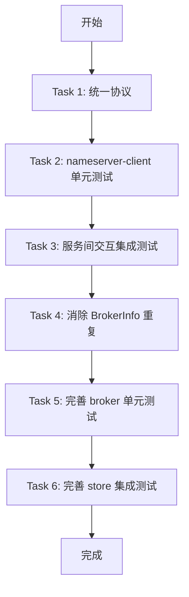

# CatMQ 功能完整性检查与完善任务

## 项目概述

CatMQ 是一个从 0 到 1 手写的消息队列，借鉴 RocketMQ 和 Kafka 的设计思路。技术栈：Java 8, Netty, Fastjson2。

## 模块架构

```
catmq
├── catmq-common       # 公共模块：数据模型、缓存、工具类
├── catmq-store        # 消息存储核心：CommitLog、ConsumerQueue、MMap 内存映射
├── catmq-broker       # Broker 服务：启动入口、配置加载、消息追加
├── catmq-nameserver   # 命名服务（服务端）
├── catmq-nameserver-client  # 命名服务客户端
├── catmq-client       # 客户端 SDK：生产者、消费者
├── catmq-cluster      # 集群相关：高可用、主从同步
├── catmq-admin        # 管理控制台
└── catmq-example      # 示例代码
```

---

## 已发现的问题

### 问题1: catmq-nameserver 与 catmq-nameserver-client 协议类定义不一致 (严重)

**描述**: 两个模块各自定义了协议类副本，字段定义存在不一致，会导致序列化/反序列化问题。

**差异详情**:

| 类名 | catmq-nameserver | catmq-nameserver-client |
|------|------------------|-------------------------|
| BaseRequest | `requestId(String)`, `timestamp(long)` | `requestId(long)` (无timestamp) |
| BaseResponse | `success(boolean)`, `requestId(long)` | `code(int)`, `requestId(String)` |
| BrokerHeartBeatRequest | 完整字段 (brokerIp, brokerPort, brokerId, topicList) | 仅 brokerName, topicList |
| TopicRouteRequest | `topic`, `clientGroup`, `fullBrokerInfo` | 仅 `topic` |
| TopicRouteResponse | `success(boolean)`, `requestId(long)` | `code(int)`, `requestId(String)` |

**影响**: 客户端和服务端无法正确通信

### 问题2: catmq-nameserver-client 缺少测试

**描述**: catmq-nameserver-client 模块没有任何测试文件

### 问题3: 三个 BrokerInfo 类重复定义

**位置**:
- `com.aoaojiao.catmq.nameserver.model.BrokerInfo`
- `com.aoaojiao.catmq.nameserver.protocol.BrokerInfo` (client)
- `com.aoaojiao.catmq.cluster.model.BrokerInfo`

---

## 任务列表

### Task 1: 统一 catmq-nameserver 和 catmq-nameserver-client 协议 (P0 - 最高优先级)

**问题描述**: 协议类定义不一致导致客户端和服务端无法正确通信

**涉及文件**:
- `catmq-nameserver/src/main/java/com/aoaojiao/catmq/nameserver/protocol/*.java`
- `catmq-nameserver-client/src/main/java/com/aoaojiao/catmq/nameserver/protocol/*.java`

**解决方案**: 将协议类提取到 catmq-common 模块统一定义

**验收标准**:
1. 所有协议类统一到 catmq-common 模块
2. catmq-nameserver 和 catmq-nameserver-client 依赖 catmq-common 的协议类
3. 协议字段统一，BaseRequest 包含 requestId(long) 和 timestamp; BaseResponse 包含 code(int) 和 requestId(long)
4. BrokerHeartBeatRequest 包含所有必要字段 (brokerName, brokerIp, brokerPort, brokerId, topicList)

---

### Task 2: 为 catmq-nameserver-client 添加单元测试 (P1)

**问题描述**: catmq-nameserver-client 模块没有任何测试

**需要添加的测试**:

1. **NameServerClientTest** - 客户端核心功能测试
   - 测试 `registerBroker()` 方法
   - 测试 `sendHeartBeat()` 方法
   - 测试 `getTopicRoute()` 方法
   - 测试连接失败处理

2. **协议类序列化/反序列化测试**
   - 测试 BaseRequest 序列化
   - 测试 BaseResponse 序列化
   - 测试各请求/响应类的序列化

**验收标准**:
1. NameServerClientTest 覆盖客户端所有 public 方法
2. 协议类序列化测试验证字段正确性
3. 所有测试通过

---

### Task 3: 完善服务间交互集成测试 (P1)

**问题描述**: 需要验证多个服务之间的交互是否正常工作

**需要添加的测试**:

1. **NameServerIntegrationTest** - NameServer 集成测试
   - 启动 NameServer
   - 使用 NameServerClient 连接
   - 测试 Broker 注册
   - 测试心跳保活
   - 测试 Topic 路由查询

2. **Broker-NameServer 集成测试**
   - Broker 启动并注册到 NameServer
   - 验证 Broker 心跳正常
   - 验证 NameServer 正确维护 Broker 列表

3. **Client-Broker-NameServer 端到端测试**
   - NameServer 启动
   - Broker 启动并注册
   - Client 通过 NameServer 获取路由
   - Client 向 Broker 发送消息
   - Client 从 Broker 消费消息

**验收标准**:
1. 集成测试覆盖核心交互流程
2. 测试使用真实 Netty 连接（非 Mock）
3. 所有集成测试通过

---

### Task 4: 消除 BrokerInfo 重复类定义 (P2)

**问题描述**: 三个模块各自定义了 BrokerInfo 类

**解决方案**: 将 BrokerInfo 提取到 catmq-common 模块

**涉及文件**:
- `catmq-nameserver/src/main/java/com/aoaojiao/catmq/nameserver/model/BrokerInfo.java`
- `catmq-nameserver-client/src/main/java/com/aoaojiao/catmq/nameserver/protocol/BrokerInfo.java`
- `catmq-cluster/src/main/java/com/aoaojiao/catmq/cluster/model/BrokerInfo.java`

**验收标准**:
1. BrokerInfo 统一到 catmq-common 模块
2. 所有模块依赖 catmq-common 的 BrokerInfo
3. 消除重复类定义

---

### Task 5: 完善 catmq-broker 单元测试 (P2)

**问题描述**: 部分 Broker 核心功能缺少测试覆盖

**需要添加的测试**:

1. **BrokerNettyHandlerTest** - Netty 处理器测试
   - 测试消息编解码
   - 测试发送请求处理
   - 测试拉取请求处理

2. **CommitLogManagerTest** - CommitLog 管理器测试
   - 测试 CommitLog 文件创建
   - 测试消息追加
   - 测试文件切换

**验收标准**:
1. Broker 核心类测试覆盖率达到 80% 以上
2. 所有测试通过

---

### Task 6: 完善 catmq-store 集成测试 (P2)

**问题描述**: 存储模块集成测试可以更完善

**需要添加的测试**:

1. **CommitLog 与 ConsumerQueue 联合测试**
   - 验证消息写入后正确分发到 ConsumerQueue
   - 验证消息拉取正确性

2. **持久化恢复测试**
   - 模拟 Broker 重启
   - 验证数据完整恢复

**验收标准**:
1. 联合测试覆盖完整数据流
2. 持久化恢复测试验证数据完整性

---

## 任务执行优先级

```
P0 (最高): Task 1 - 协议统一
P1 (高):   Task 2 - catmq-nameserver-client 单元测试
P1 (高):   Task 3 - 服务间交互集成测试
P2 (中):   Task 4 - 消除 BrokerInfo 重复类
P2 (中):   Task 5 - 完善 catmq-broker 单元测试
P2 (中):   Task 6 - 完善 catmq-store 集成测试
```

---

## 测试覆盖率现状

| 模块 | 测试数量 | 覆盖率 |
|------|---------|--------|
| catmq-nameserver | 1 | 低 |
| catmq-nameserver-client | 0 | 无 |
| catmq-client | 2 | 中 |
| catmq-broker | 5 | 中 |
| catmq-store | 6 | 中 |
| catmq-cluster | 2 | 低 |
| catmq-admin | 2 | 中 |

---

## 执行流程



**注意**: Task 1 必须首先完成，因为它是其他任务的基础。Task 2-6 可以并行执行，但需要基于 Task 1 的结果。
